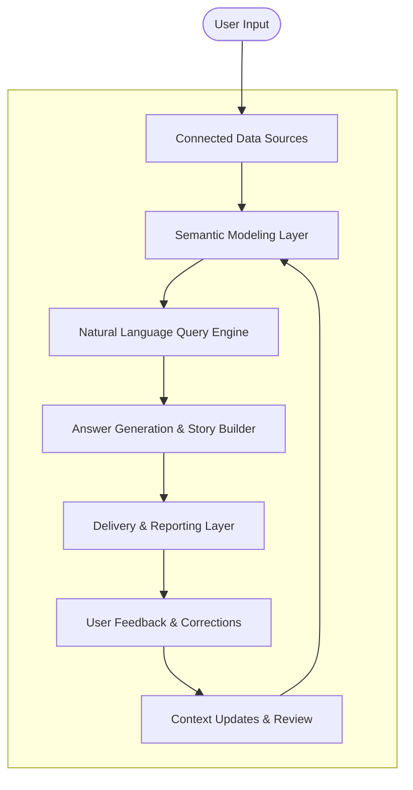

## What Does WisdomAI Do?

WisdomAI transforms enterprise data into clear, actionable insights using advanced Natural Language Processing (NLP), contextual modeling, and automated storytelling. Designed to support data-driven decision-making at every level, it enables both technical teams and business users to explore and communicate insights, without needing to write code or build dashboards manually.

## Who Is This For?

WisdomAI is designed with two core user roles in mind:

- **Admins**: who connect data sources, manage access controls, and define semantic models.
- **Explorers**: who use the platform to ask questions, discover insights, and share dynamic stories.

This documentation is segmented accordingly, so you can focus on what matters most to your role. For more information on each role, visit the [Overview](/getting-started/overview) page.

## WisdomAI vs Generic RAG Systems

Unlike generic Retrieval-Augmented Generation (RAG) solutions that rely purely on embedding search over documents, **WisdomAI builds a structured understanding of your data** through semantic modeling, curated context, and validated logic.

| Feature                           | WisdomAI | Generic RAG |
| --------------------------------- | -------- | ----------- |
| Understands data relationships    | ✅        | ❌           |
| Requires semantic modeling        | ✅        | ❌           |
| Validated, testable logic         | ✅        | ❌           |
| Dynamic, auto-updating dashboards | ✅        | ❌           |
| Tailored for business data        | ✅        | ❌           |

WisdomAI is purpose-built for enterprise analytics, not just document Q&A.

## Data Flow & Architecture Overview

WisdomAI transforms your business data into actionable insights using a multi-layered pipeline. The following components work together to deliver accurate, contextualized answers and auto-updating data stories.

<Steps>
  <Step title="Connected Data Sources" icon="check" titleSize="h3">
    WisdomAI integrates with your data platforms (like Snowflake, BigQuery, or Redshift), acting as the entry point of all information flowing through the system.
  </Step>
  <Step title="Semantic Modeling" icon="check" titleSize="h3">
    Admins and data owners enrich the data by documenting tables, columns, and domains. They also define relationships (e.g., one-to-many, many-to-many) to create a business-friendly context for natural language understanding.
  </Step>
  <Step title="Natural Language Query (NLQ) Engine" icon="check" titleSize="h3">
    Business users (Explorers) ask questions in plain language. The NLQ engine parses these questions and translates them into SQL queries using the underlying semantic model.
  </Step>
  <Step title="Answer Generation and Story Builder" icon="check" titleSize="h3">
    Responses are generated and formatted into interactive "Stories", data-driven narratives that combine visualizations, text, and insights. These can be scheduled and shared.
  </Step>
  <Step title="Delivery and Reporting Layer" icon="check" titleSize="h3">
    Stories and answers can be delivered via email or embedded within dashboards, helping teams stay informed with minimal effort.
  </Step>
  <Step title="User Feedback and Corrections" icon="check" titleSize="h3">
    Users can give feedback on story accuracy, suggest corrections, or add clarifying context to improve future results.
  </Step>
  <Step title="Context Updates and Review Loop" icon="check" titleSize="h3">
    Admins and Editors review user feedback and update the semantic layer accordingly, closing the loop and continuously improving answer quality and domain understanding.
  </Step>
</Steps>

### Data Flow Diagram

## Next steps

- [Overview](/getting-started/overview)
- [Supported Data Sources](/getting-started/supported-data-sources)
- [Basic Tutorial Connect and Test](/setting-up-wisdom-ai/basic-tutorial-connect-and-test)
- [Advanced Tutorial: Fine Tuning Your Context](/setting-up-wisdom-ai/advanced-tutorial-fine-tuning-your-context)
- [Provide Feedback to the System](/setting-up-wisdom-ai/provide-feedback-to-the-system)
- [Turn Answers into Stories](/using-wisdom-ai-everyday/turn-answers-into-stories)