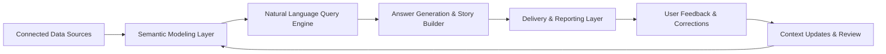

## What Does WisdomAI Do?

WisdomAI transforms enterprise data into clear, actionable insights using advanced Natural Language Processing (NLP), contextual modeling, and automated storytelling. Designed to support data-driven decision-making at every level, it enables both technical teams and business users to explore and communicate insights—without needing to write code or build dashboards manually.

## Who Is This For?

WisdomAI is designed with two core user roles in mind:

- **Admins** — who connect data sources, manage access controls, and define semantic models.
- **Explorers** (or Editors) — who use the platform to ask questions, discover insights, and share dynamic stories.

This documentation is segmented accordingly, so you can focus on what matters most to your role.

## WisdomAI vs Generic RAG Systems

Unlike generic Retrieval-Augmented Generation (RAG) solutions that rely purely on embedding search over documents, **WisdomAI builds a structured understanding of your data** through semantic modeling, curated context, and validated logic.

| Feature                           | WisdomAI | Generic RAG |
| --------------------------------- | -------- | ----------- |
| Understands data relationships    | ✅        | ❌           |
| Requires semantic modeling        | ✅        | ❌           |
| Validated, testable logic         | ✅        | ❌           |
| Dynamic, auto-updating dashboards | ✅        | ❌           |
| Tailored for business data        | ✅        | ❌           |

WisdomAI is purpose-built for enterprise analytics, not just document Q&A.

## Platform Architecture

Below is a simplified architecture diagram followed by a narrative walkthrough of each layer.

### Data Flow Diagram

