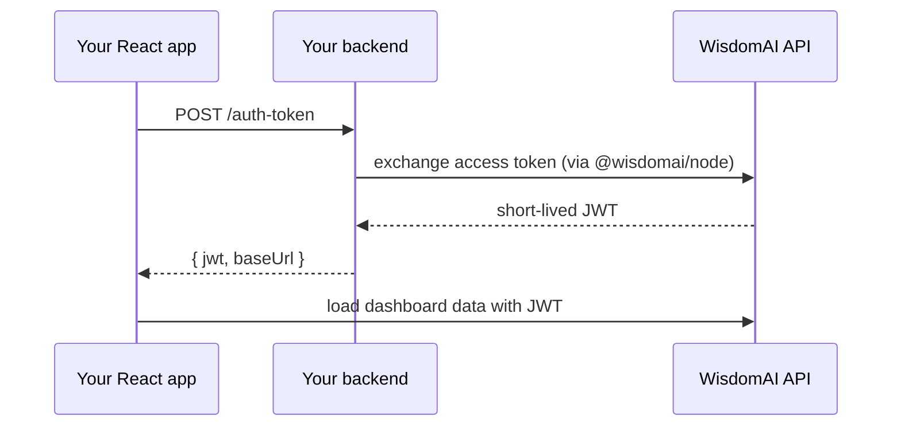

The SDK uses a two-package auth model: `@wisdomai/node` runs on your backend and mints short-lived tokens; `WisdomProvider` runs in the browser and consumes them. Your long-lived access token never reaches the browser.

## How it works

Your long-lived access token is a secret and must **never** reach the browser. The flow is:

```txt
sequenceDiagram
  participant Browser as Your React app
  participant Backend as Your backend
  participant Wisdom as WisdomAI API
  Browser->>Backend: POST /auth-token
  Backend->>Wisdom: exchange access token (via @wisdomai/node)
  Wisdom-->>Backend: short-lived JWT
  Backend-->>Browser: { jwt, baseUrl }
  Browser->>Wisdom: load dashboard data with JWT
```



1. Your **backend** holds the access token and uses `@wisdomai/node` to exchange it for a short-lived JWT.
2. Your **frontend** calls a same-origin endpoint (e.g. `POST /auth-token`) to fetch that JWT.
3. `WisdomProvider` fetches the JWT on load and **refreshes it before it expires** — you don't manage token lifecycle yourself.

## Backend: exchange the token (`@wisdomai/node`)

Construct a `WisdomAI` client with your access token and base URL, then call `getAuthToken()` to mint a short-lived JWT. It returns `{ jwt, baseUrl }`, which is exactly the shape the frontend provider expects.

```jsx
import { WisdomAI } from '@wisdomai/node';
const wisdom = new WisdomAI({
  accessToken: process.env.WISDOM_ACCESS_TOKEN, // server-side secret
  baseUrl: process.env.WISDOM_BASE_URL,         // https://your-org.wisdom.ai
});
// inside your route handler:
const token = await wisdom.getAuthToken(); // -> { jwt, baseUrl }
```

<Tip>
  See [Quickstart](integrations/embeddings/sdk/sdk-quickstart) for the full Express endpoint example.
</Tip>

## Frontend: `WisdomProvider`

By default, `WisdomProvider` fetches the token from a same-origin `POST /auth-token` and refreshes it before expiry. To point it elsewhere (or add headers/credentials), pass your own `getAuthToken`:

```tsx
<WisdomProvider
  getAuthToken={async () => {
    const res = await fetch('/auth-token', { method: 'POST' });
    return res.json(); // must resolve to { jwt, baseUrl }
  }}
  theme={/* ... */}
>
  {/* dashboards, widgets */}
</WisdomProvider>
```

## Multi-tenant data isolation

If you serve multiple customers (or want each end user to see only their own data), have your backend issue a **per-user** JWT when exchanging the token. Wisdom applies row-level security based on that user identity, so each viewer only sees the rows they're entitled to, without you building separate dashboards per tenant.

## Token lifecycle

Embedded JWTs are short-lived (about one hour) and the provider refreshes them automatically. For the full refresh mechanics and how switching users works, see the shared **Token Lifecycle and Refresh** page under Integrations → Embeddings.

## Next steps

<Card title="Quickstart" icon="rocket" href="integrations/embeddings/sdk/sdk-quickstart">
  Set up the SDK and embed your first dashboard in minutes.
</Card>

<Card title="Components" icon="react" href="integrations/embeddings/sdk/sdk-components">
  Browse the React components available for embed a full dashboard, composable widgets, and filters.
</Card>