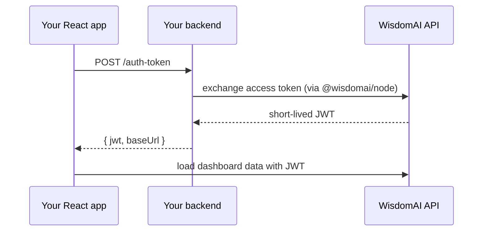

The WisdomAI Embedded SDK is a React component library for embedding WisdomAI dashboards natively inside your product. Instead of embedding the entire WisdomAI surface as an external add-on, you can compose individual components directly into your existing UI, with support for theming, host-controlled layout, and programmatic filter control.

## Core components

The SDK exposes three primary building blocks.

**`WisdomProvider`** wraps your application and handles authentication and GraphQL transport. It accepts a `graphqlUrl` and a `tokenProvider` function that returns a JWT. All other SDK components must be descendants of this provider.

**`WisdomDashboard`** renders the embedded dashboard surface. It accepts a `dashboardId` prop and handles widget rendering, data fetching, and reactive filter updates automatically.

**`WisdomGlobalFilters`** is a decoupled filter control surface that can be placed anywhere in the host layout (above, beside, or inside a sidebar), independent of the dashboard component itself.

Your developers do not need to manage transport, auth wiring, or widget rendering. Refs and callbacks are available for deeper customization but are not required.

## What you can do today

The SDK exposes the following embedding capabilities:

- **Embed a full dashboard**: Drop an entire Wisdom dashboard into a page with a single component.
- **Embed a single widget**: Render one chart, metric, or table on its own and place it anywhere in your UI.
- **Interactive analytics**: Charts, time series, stacked breakdowns, data tables, and KPI metrics, all fully interactive (zoom, tooltips, export-to-data).
- **Filtering**: Show Wisdom's built-in filter bar, or drive filters from your own application state.
- **Theming**: Match the embedded content to your product's colors, typography, and chart palette.
- **Multi-tenant ready**: Issue per-user tokens so each of your end users only sees the data they're entitled to.

## Packages

The SDK is published publicly on the **npm registry** under the `@wisdomai` scope:

| Package | Registry | Use |
| --- | --- | --- |
| `@wisdomai/react` | [npmjs.com/package/@wisdomai/react](http://npmjs.com/package/@wisdomai/react) | React component library: providers, `Dashboard`, widgets, hooks. Runs in the browser. |
| `@wisdomai/node` | [npmjs.com/package/@wisdomai/node](http://npmjs.com/package/@wisdomai/node) | Server-side helper that exchanges your long-lived access token for a short-lived JWT the browser can safely use. Runs on your backend only. |

Both packages are MIT-licensed and ESM-first.

## How authentication works

Your long-lived access token is a secret and must **never** reach the browser. The flow is:

```txt
sequenceDiagram
  participant Browser as Your React app
  participant Backend as Your backend
  participant Wisdom as WisdomAI API
  Browser->>Backend: POST /auth-token
  Backend->>Wisdom: exchange access token (via @wisdomai/node)
  Wisdom-->>Backend: short-lived JWT
  Backend-->>Browser: { jwt, baseUrl }
  Browser->>Wisdom: load dashboard data with JWT
```



1. Your **backend** holds the access token and uses `@wisdomai/node` to exchange it for a short-lived JWT.
2. Your **frontend** calls a same-origin endpoint (e.g. `POST /auth-token`) to fetch that JWT.
3. `WisdomProvider` automatically fetches the JWT on load and **refreshes it before it expires**. You don't manage token lifecycle yourself.

## Minimal integration

The following example produces a working embedded dashboard with filters:

```jsx
import { WisdomProvider, WisdomDashboard, WisdomGlobalFilters } from 'react-dashboard-sdk-wisdom';

export function CustomerDashboardPage({ dashboardId }) {
  const dashboardRef = useRef(null);

  return (
    <WisdomProvider graphqlUrl="https://your-host/graphql" tokenProvider={() => 'your-jwt-token'}>
      <WisdomGlobalFilters dashboardId={dashboardId} dashboardRef={dashboardRef} />
      <WisdomDashboard ref={dashboardRef} dashboardId={dashboardId} />
    </WisdomProvider>
  );
}
```

Your developers do not need to manage transport, auth wiring, or widget rendering. Refs and callbacks are available for deeper customization but are not required.

## Theming and layout

The SDK supports theme switching, and the same integration can serve multiple visual identities. Wrap the embed in your own layout and controls to make it feel native to your product.

## FAQs

<AccordionGroup>
  <Accordion title="Is this a React-only SDK?">
    The current release is React. Web component and framework-agnostic support is on the roadmap.
  </Accordion>

  <Accordion title="How does authentication work?">
    `WisdomProvider` accepts a `tokenProvider` function that returns a JWT. Your backend controls token generation and expiry. No WisdomAI credentials are exposed in the browser.
  </Accordion>

  <Accordion title="Does the SDK support multi-tenant isolation with row-level security?">
    Yes. JWT-based authentication carries the user's identity, which WisdomAI uses to enforce row-level security. Each embedded user sees only their own data.
  </Accordion>

  <Accordion title="What happens when the JWT expires?">
    A `tokenProvider` that returns a fresh token on each call is the recommended pattern for long-lived sessions.
  </Accordion>

  <Accordion title="Is the iframe embedding approach still supported?">
    Yes. The iframe path remains available and unchanged. The SDK is an additive option for teams that need composability, theming, or programmatic filter control beyond what iframes support.
  </Accordion>

  <Accordion title="Can we customize which dashboard filters are shown?">
    `WisdomGlobalFilters` renders the filters configured on the dashboard. Refs and callbacks give your application programmatic control over the filter state for tighter native integration.
  </Accordion>
</AccordionGroup>

## Next steps

<CardGroup cols={2}>
  <Card title="Embedding overview" icon="window-restore" href="/integrations/embeddings/embedding">
    Understand the full embedding architecture and choose the right integration path for your use case.
  </Card>

  <Card title="GraphQL API" icon="brackets-curly" href="/integrations/embeddings/graphql-api/GraphQL-API">
    Explore the GraphQL API available to embedded integrations for user management and data access.
  </Card>
</CardGroup>